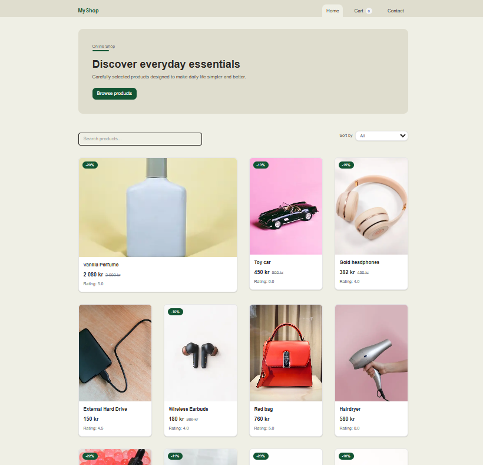

# MyShop – Online Store

A modern online shop built with **Next.js and TypeScript**.  
The site fetches products from an API, allows users to browse items, search and sort products, view product details, and add items to a shopping cart before completing checkout.

## Project preview 

# Live Site

Netlify deployment:  
[(https://jsframework-anna.netlify.app/)]

# Features

- Browse products from API
- Product detail pages
- Search products
- Sort products (All / Price / etc.)
- Add to cart
- Update item quantity
- Remove items from cart
- Checkout flow
- Checkout success page
- Loading states for API content
- Error handling for failed API requests
- Responsive layout for mobile and desktop

# Tech Stack

- **Next.js**
- **React**
- **TypeScript**
- **Tailwind CSS**
- **Netlify** for deployment

## Installation

1. Clone the repository
2. Install dependencies with `npm install`
3. Run the project with `npm run dev`

## API
Products are fetched from the Noroff Online Shop API:
https://api.noroff.dev/api/v1/online-shop

## AI Use
Ai tools were used as a learning support 
Example tasks where AI assisted:
- Explaining Next.js concepts
- Debugging layout and CSS issues 
- Guidance on component structure 

All code was written and implemented manually after understanding the explanations.